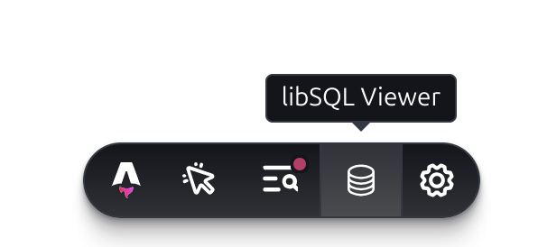

import { PackageManagers } from 'starlight-package-managers'
import { Steps, Tabs, TabItem } from '@astrojs/starlight/components';

# Introduction

A Collection of useful tools available during dev mode in Astro.

## Installation

<Tabs syncKey='install-method'>
  <TabItem label="Astro Method" icon='astro'>
{/* <Steps> */}
1. Install the package and add to your astro config using the following command:

   <PackageManagers type="exec" pkg="astro" args="add @studiocms/devapps" />

2. Update your config file as shown under [Example Config](#example-config) below.
{/* </Steps> */}
  </TabItem>
  <TabItem label="Manual Method" icon='seti:powershell'>
{/* <Steps> */}
1. Install the package using the following command:

   <PackageManagers pkg="@studiocms/devapps" />

2. Add `@studiocms/devapps` to your astro config file:

   ```ts twoslash title="astro.config.mjs" ins={3, 9}
   import { defineConfig } from 'astro/config';
   import db from '@astrojs/db';
   import devApps from '@studiocms/devapps'; 

   export default defineConfig({
      site: "https://example.com",
      integrations: [
          db(),
          devApps(), 
      ],
   });
   ```
{/* </Steps> */}
  </TabItem>
</Tabs>

## Usage

All tools will only be available during `astro dev` and will not be available during production deployments!

### Example config

```ts twoslash title="astro.config.mjs" {2, 8} ins={3, 9}
import { defineConfig } from 'astro/config';
import db from '@astrojs/db';
import devApps from '@studiocms/devapps';

export default defineConfig({
  site: "https://example.com",
  integrations: [
    db(), // REQUIRED
    devApps(/* See Config Options Below */),
  ],
});
```

### Config Options

Full list of options available for the `devApps` integration, with default values shown. **All options are optional**.

```ts twoslash 
import devApps from '@studiocms/devapps';
devApps({
// ---cut---
endpoint: '_studiocms-devapps',
verbose: false,
appsConfig: {
  libSQLViewer: true,
  wpImporter: true,
},
// ---cut-after---
})
```

## Tools

### libSQL Viewer

Development tool to view the SQL tables in the libSQL database in the browser. The tool rely's on the `@astrojs/db` libSQL remote database connection credentials.

#### Requirements

The following env variables set (Also used for `@astrojs/db`):
- **`ASTRO_DB_REMOTE_URL`**
- **`ASTRO_DB_APP_TOKEN`**

#### Preview Usage

- Toolbar app (Closed)



- Toolbar app (Expanded)


### Wordpress Importer

Development tool to import WordPress posts and pages into the StudioCMS database.

#### Requirements

- StudioCMS Integration
- WordPress Install
- `@studiocms/blog` (Optional: for importing Posts under a blog)

#### Preview Usage

- Toolbar app


