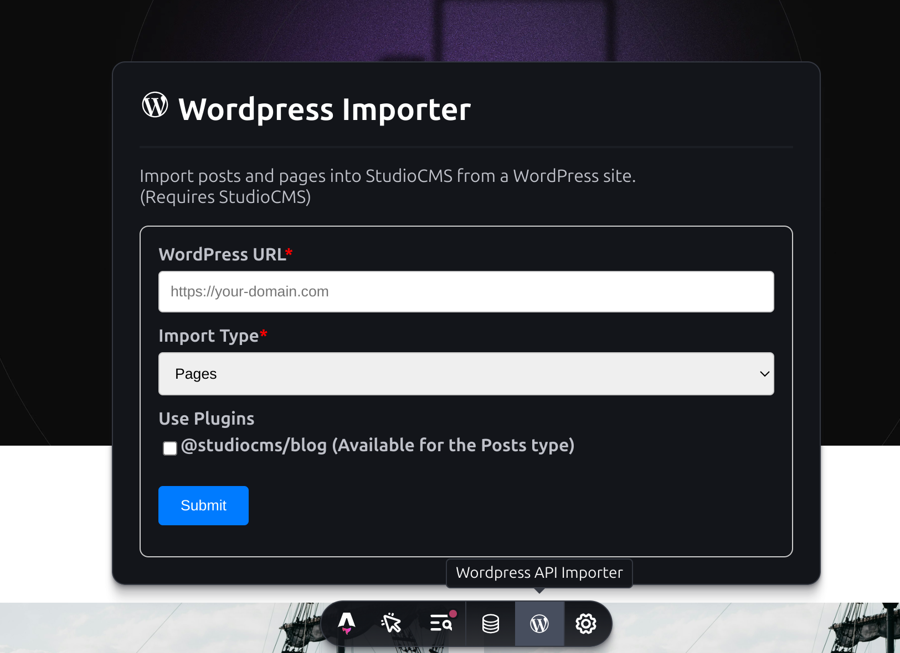

# StudioCMS - Development Apps

[](https://codecov.io/github/withstudiocms/studiocms)

Collection* of useful tools available during dev mode in Astro

## Installation

Install the integration **automatically** using the Astro CLI:

```bash
pnpm astro add @studiocms/devapps
```

```bash
npx astro add @studiocms/devapps
```

```bash
yarn astro add @studiocms/devapps
```

Or install it **manually**:

1. Install the required dependencies

```bash
pnpm add @studiocms/devapps
```

```bash
npm install @studiocms/devapps
```

```bash
yarn add @studiocms/devapps
```

2. Add the integration to your astro config

```diff
+import devApps from "@studiocms/devapps";

export default defineConfig({
  integrations: [
+    devApps(),
  ],
});
```

## Usage

All tools will only be available during `astro dev` and will not be available during production deployments!

### WordPress Importer

#### Requires

- StudioCMS Integration
- A current WP Install
- `@studiocms/blog` (Optional for importing Posts under a blog)

#### Preview

- Toolbar app



## Licensing

[MIT Licensed](./LICENSE).

